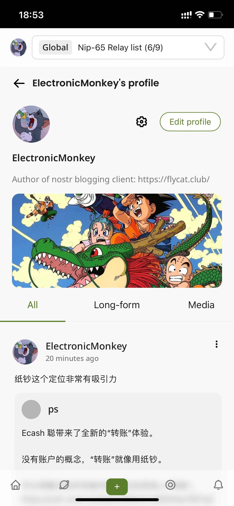

# Flycat, A New Way to Exit Toxic Internet

Open social network built on [Nostr protocol](https://github.com/nostr-protocol/nips).

## Lastest News

Flycat v0.2.x release 🎉🎉🎉

Curious what will be next? Checkout our [Real Time Roadmap](https://github.com/users/digi-monkey/projects/1/views/4?sliceBy%5BcolumnId%5D=53966968)!

## Install

- [Install PWA app](https://flycat.club/landing)
- [Visit website](https://flycat.club)

## Main Differences

- built-in relay selector for easy switching/managing different relay groups and context
- support gossip mode/auto relay discovering
- no follower count, like button and private recommendation algorithm, non-addictive, peaceful light mode
- browsing short-notes/articles/media-notes/highlights/global-notes in one client
- support Nip172 communities
- multiple ways to sign-in: getAlby/Nostr2x/Metamask/WalletConnect/JoyID/DotBit etc
- no database/custom backend/private caching server, self-hosted made pretty effortless
- use SharedWorker to manage one global websocket connections pool across different web page/browser tabs

## Join Us, Why Not?

Flycat is a open-source project and would love to have a community building and maintaining it. We are looking for volunteers to eagerly solve issues, create pull requests and implementing new features. Feel free to contribute or just talk about your ideas.

check out [project development instructions](docs/develop.md)

## Fun Facts

How it started

How it goes

## Find me on Nostr

[nostr:npub1ghzp7g0peac4lfkeegst3cqz546dk7a5n6twazvrf3nd432yddaqa3qtwq](https://flycat.club/user/45c41f21e1cf715fa6d9ca20b8e002a574db7bb49e96ee89834c66dac5446b7a)
